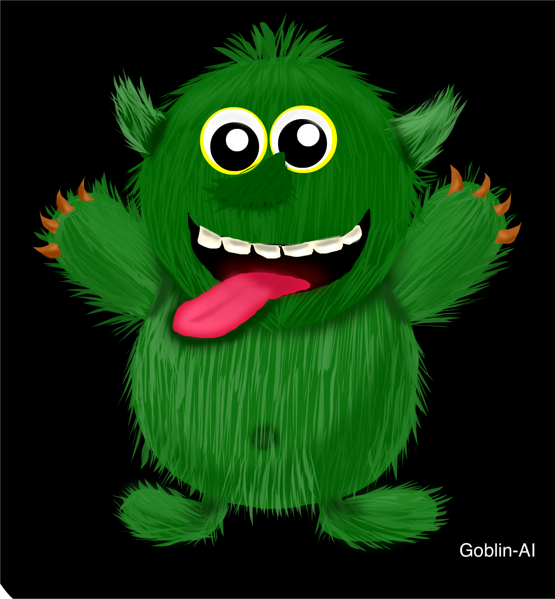

## Start Day: Tuesday, 24 September 2019

## Goblin-AI Introduction
1. Goblin AI is a library of deep learning models and datasets designed to make deep learning more accessible

2. The ultimate goal of SEMI-AutoDL is to provide easily accessible deep learning tools to domain experts with limited data science or machine learning background

3. Supported Ai-Goblin provides the visualization and tooling needed for Deep Learning experimentation (with VisDom)

4. Supported Experiment with various deep learning methods using the JupyterLabs

5. Each of the Deep Learning models is independent and simple to apply to the application

6. [Build a Goblin-AI Deep Learning Model with Ai-hub data)](http://www.aihub.or.kr/) 

## Major features (Click the link)

### Computer Vision

- [Joint Attention Expansion Pyramid Network for Text Region Segmentation](https://github.com/helakim/goblin-ai/tree/master/pytorch_version/text_segmentation_v1) - (Called by JYP)
- [Expansion Pyramid Network for high resolution face detection](https://github.com/helakim/goblin-ai/tree/master/pytorch_version/face_detection) - (Called by Only-U)
- [Re-Extraction-Network for Special Trace MAP](https://github.com/helakim/goblin-ai/tree/master/pytorch_version/re_extraction_network) - (Called by Argos-EYE)
- [High Efficient non-lexicon `A` model for Korean Text Recognition](https://github.com/helakim/goblin-ai/tree/master/pytorch_version/text_recognition_v1) - (Called by HELA-EYE)
### Neural Graph

- [Graph-based Korean sentence summary algorithm](https://github.com/helakim/goblin-ai/tree/master/graph_algorithm/text_summary) - (Called by Cerberus Summary)

### Neural Language Processing

- [GB-pool with weighted convolution for large scale text Classification](https://github.com/helakim/goblin-ai/tree/master/keras_version/text_classification)

### Explainable Deep Learning Model
  - Coming Soon :)

### End to End Deep Learning Model
  - Coming Soon :)

### Toy project created using Goblin-AI (Using `Goblin-AI`)
 - [Neural Language Processing Application Level](https://github.com/helakim/goblin-ai/tree/master/application/quasar) - (Called by Quasar) 
    1.  Using `Cerberus Summary` (Graph-based Korean sentence summary algorithm)
    
    2.  Using GB-pool with weighted convolution for large scale text Classification

### Experiment of Deep learning model
 - Coming Soon :)
 
### ETC
 - [Simple Representational State Transfer API Model Server for Goblin-Ai Deploy](https://github.com/helakim/goblin-ai/tree/master/application/basic_model_server)
 
## Updates

#### version: 0.0.6 (11, october, 2019)
 - A `VueJS` implementation of Quasar (Application of Goblin AI)
 - A `Flask` implementation of Rest API Server (Serving Goblin AI models)
 - A `Keras` implementation of GB-pool with weighted convolution for large scale text Classification
 - Fixed some bugs and typo

#### version: 0.0.5 (05, october, 2019)
 - A `pure pytorch` implementation of Korean Text Recognition
 - Implement lots of new methods and components
 - Add inference result
 - Add visualization mode
 - Improving training model
 - Custom CTC loss function
    
#### version: 0.0.4 (04, october, 2019)
 - A `pure pytorch` implementation of Joint Attention Expansion Pyramid Network for Text Region Segmentation
 - Add inference result
 - Add visualization mode
 - Improving training model (JYP)

#### version: 0.0.3 (03, october, 2019)
 - A `pure pytorch` implementation of Re-Extraction-Network for Special Trace MAP
 
#### version: 0.0.2 (02, october, 2019)
 - A `pure pytorch` implementation of Expansion Pyramid Network for high resolution face detection
 - Add inference result
 - Improving training model (Only-U)  

#### version: 0.0.1 (29, september, 2019)
 - Implementation of the Cerberus Summary using Python only
 - Add the cerberus summary inference code
 
 
## Contributing
appreciate all contributions to improve `goblin-ai` Please refer to CONTRIBUTING.md for the contributing guideline.
   
## Author
 - Kyung Tae Kim (kt.kim@acm.org)
