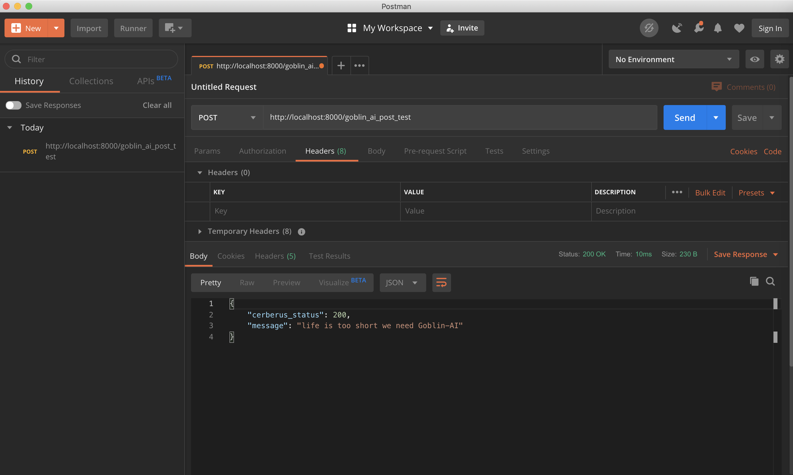
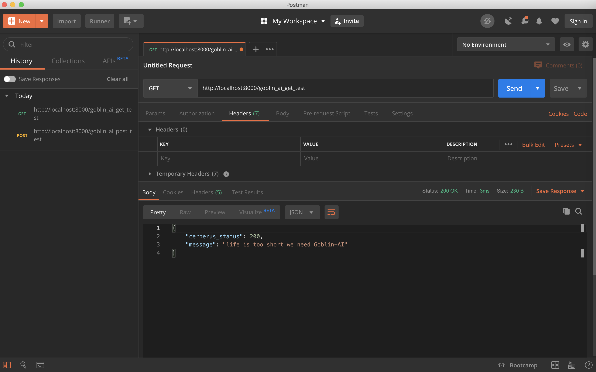

## Simple RestApi Model Server for Goblin-Ai Deploy :)
1. rest api server to distribute goblin ai models
2. supports computer vision and natural language processing

## Setup
``` bash
run: pip install -r requirements.txt in your shell.
```

## Usage
Start the *Goblin-AI* server from the command line
``` bash
python3 server.py
```
*Goblin-AI* now can be accessed by going to http://localhost:8000 in your browser, or your own host address if specified.

#### GET request and response


#### POST request and response


## Goblin-AI Server Arguments
 1. `ALLOWED_EXTENSIONS` is the set of allowed file extensions.
 2. `MAX_CONTENT_LENGTH` the code above will limit the maximum allowed payload to 16 megabytes. If a larger file is transmitted.
 3. `ENV_DEFAULT_PORT` default port
 4. `JSON_ADD_STATUS` put HTTP status field in all JSON responses.
 5. `JSON_STATUS_FIELD_NAME` name of the field with HTTP status in JSON response.
 6. `JSON_DECODE_ERROR_MESSAGE` default error response message for the invalid JSON request.
 7. `APP_HOST_NAME:` application host name
 8. `SECRET_KEY: ` secret key
 
## TODO
1. [ ] computer vision module
2. [ ] natural language processing module
3. [ ] add `GRPC` server

## References
1. [Flask is a lightweight WSGI web application framework](https://palletsprojects.com/p/flask/)

2. [gRPC - An RPC library and framework](https://grpc.io/)
