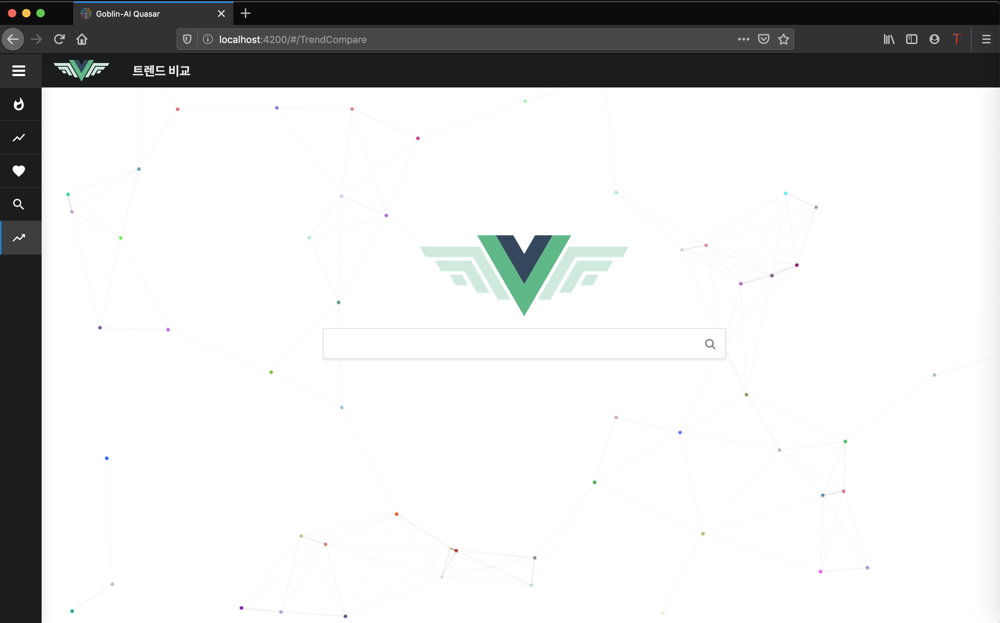

## Goblin AI Quasar (Local Test Done)



## Introduce (Korean Version)
- Goblin-AI의 모델을 사용하여 만든 NLP Application입니다.

- 제공 되는 기능으로 문서의 키워드 추출 및 통계, 문서 연관 검색어, 문서요약, 문서 분류, 문서들 간의 Trend compare (google trend와 유사기능), 문서들간의 관계도 분서 및 다양한 기능을 제공 합니다 또한 Application Feature를 재조합 하면 또다른 기능을 만들 수 있는 유연합 Application입니다

- 순수하게 Pure Javascript + VueJs 만으로 Ui Interaction에서 Bottle neck부분이 존재 하지 않습니다

- 기능을 중심으로 Component가 분리 되어있기 때문에 새로운 기능을 추가하는것이 굉장히 쉽습니다 (시각화 모듈 혹은 새로운 기능)

- Less를 사용하여 CSS부분의 공통적인 디자인을 간편하게 무듈화 시켜서 관리 하고 있습니다

- Application build시에 webpack를 사용하여 의존 모듈을 한곳에서 관리 가능하고 e2e테스트도 동시에 제공 합니다 (with grant)

## Goblin-AI Feature Lists

- Using Cerberus Summary (Graph-based Korean sentence summary algorithm)

- Using GB-pool with weighted convolution for large scale text Classification

## Environment

- Node Js >= v10.16
- NPM >= 6.9.0
- VueJS
- Grant


## Get Started
1. Node Js + NPM Download and Installation
```bash
node --version & npm --version 
# 올바르게 설치 될 경우 버전 정보가 출력됩니다
# 자세한 설치 방법은 NodeJS 공식 홈페이지를 참고해주세요.
v10.16.3
v6.9.0
```

2. NPM을 이용하여 Package 설치
```bash
git clone https://github.com/helakim/goblin-ai/tree/master/application/quasar
cd quasar

npm install 
```

3. localhost 서버 실행
```
1. npm build (webpack을 사용하여 build)
2. npm run dev
3. 127.0.0.1:4000 (기본 포트는 quasar/config 에서 설정 할 수 있습니다)
```

## Todo
 - [X] Add reference

## Author
 - kyung tae kim (firefoxdev0619@gmail.com)

## References
1. [NodeJS Official Download](https://nodejs.org/en/)
2. [Vue JS](https://vuejs.org/)
3. [webpack](https://webpack.js.org/)
4. [MDN web-documents](https://developer.mozilla.org/en-US/docs/Web/JavaScript/Guide)
5. [Nuclear Pumpkin Mocha](https://www.npmjs.com/)

```
@misc{Quasar 2019,
  author =       {kyung tae kim},
  title =        {Quasar},
  howpublished = {\url{https://github.com/helakim/goblin-ai/tree/master/application/quasar}},
  year =         {2019}
}
```

## Contact
For any question, feel free to contact :)
```
kyung tae kim     : firefoxdev0619@gmail.com
```
