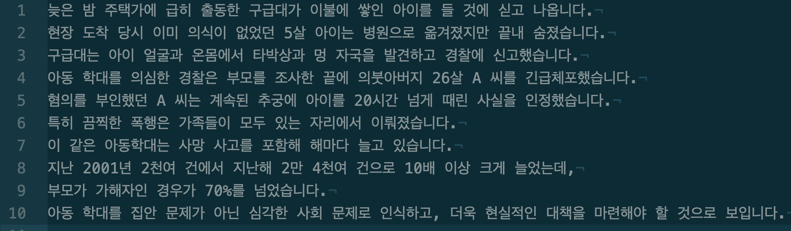
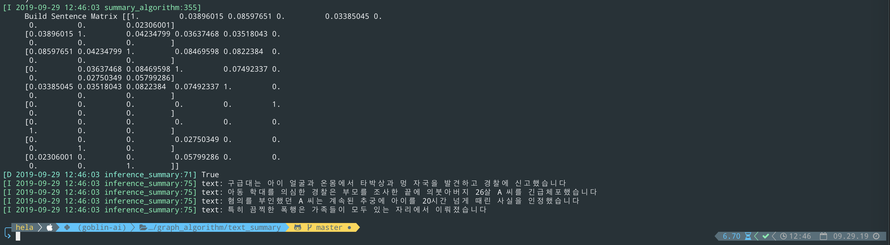

<div align="center">
  <br><br>
</div>

---

| **`Status`** | **`Pyhon version`** | **`Language`** | **`Windows`** | **`Crated`** | **`Description`** | **`build`** |
|---------------------|------------------|-------------------|---------------|---------------|---------------|---------------|
| |||  |||

---

# **Cerberus Summary (Monday 23, sep 2019)**

1. **Cerberus Summary** is a python library graph-based ranking modle for document processing algorithm

2. cerberus summary is a  a graph-based algorithm, so you don't have to do machine learning.

3. A few hyper-parameters can be modified to get the results of the desired document summary

4. cerberus summary is an algorithm for summarizing long Korean sentences.

5. Korean documents will be added later (coming soon)


## Installation (Denpendencies)

#### Cerberus Summary requires:
    1. scikit-learn >= 0.19
    2. gensim >= 3.4.0
    3. numpy >= 1.14.1
    4. networkx >= 2.1
    5. konlpy >= 0.4.4
 
For running the mecab(corpus) >= JPype1-python 0.5.5.2 required.
<br>
<br>
#### User installation

Mecab is a Java Library for nlp of the korean language (optional)
- If you install the Mechab library, you can run algorithms faster.
- It doesn't have much impact on the results.
```shell
$ ./ubuntu_mecab_install.sh
```
<br>
<br>

#### The easiest way to install Cerberus Summary is using python3

```bash
$(3.5) python setup.py install 
``` 
<br>
<br>

#### Try you first Cerberus Summary Package

```bash
# to add anaconda environment later
source activate ${goblin-ai}
```
<br>
<br>

#### Step 2. import library(cerberus summary)

```bash
$(3.5) python
```

```python
>>> from __future__ import absolute_import
>>> from text_summary.models.summary_algorithm import CerberusSummary
```

<br>
<br>

#### Step 2-1. cerberus summary class load

1. The first vector space contains a condensed sentence.
2. The second vector space contains a tokenized index of the document.
3. The last vector space contains a bag of words.

```python
>>> from text_summary.cfg.logger import logger as say 

>>> cerberus_summary = text_summary.models.summary_algorithm.CerberusSummary()  # Load(CerberusSummary object) 
>>> sentences_bucket = ['life', 'is','to', 'short', 'we', 'need', 'python']
>>> cerberus_summary.summary_works(sentences_bucket)

>>> for _, st in enumerate(cerberus_summary):
>>>     say.info(st[0])   # summary of document           
>>>     say.info(st[1])   # token of document
>>>     say.info(st[-1])  # counter(bag of word)
```
<br>
<br>

#### Step 3. Result (text summary)
```
 First, move the documents in the samples directory
 Second, run inference_summary.py
```

- original news document (samples/news_1.txt)


- Document Summary Results (cerberus summary)


- original news document (samples/news_2.txt)


- Document Summary Results (cerberus summary)


#### Todo
- [X] py text + tox.ini
- [X] corpus support (Twitter, Human, etc...)
- [X] K - Cluster (Euclidean distance - algorithm)
- [ ] Power method (Markov matrices formulti calculator)


#### For more information
 - Todo

#### Author
 - kyung tae kim (firefoxdev0619@gmail.com)

#### References
- [A Density-Based Algorithm for Discovering Clusters in Large Spatial Databases with Noise](http://www.aaai.org/Papers/KDD/1996/KDD96-037.pdf)
- [Distributed Representations of Words and Phrases and their Compositionality](https://papers.nips.cc/paper/5021-distributed-representations-of-words-and-phrases-and-their-compositionality.pdf)
- [Markov matrices](http://www.math.harvard.edu/~knill/teaching/math19b_2011/handouts/lecture33.pdf)

```
@misc{CerberusSummary 2019,
  author =       {kyung tae kim},
  title =        {CerberusSummary},
  howpublished = {\url{https://github.com/helakim/goblin-ai/tree/master/graph_algorithm/text_summary}},
  year =         {2019}
}
```

## Contact
For any question, feel free to contact :)
```
kyung tae kim     : firefoxdev0619@gmail.com
```