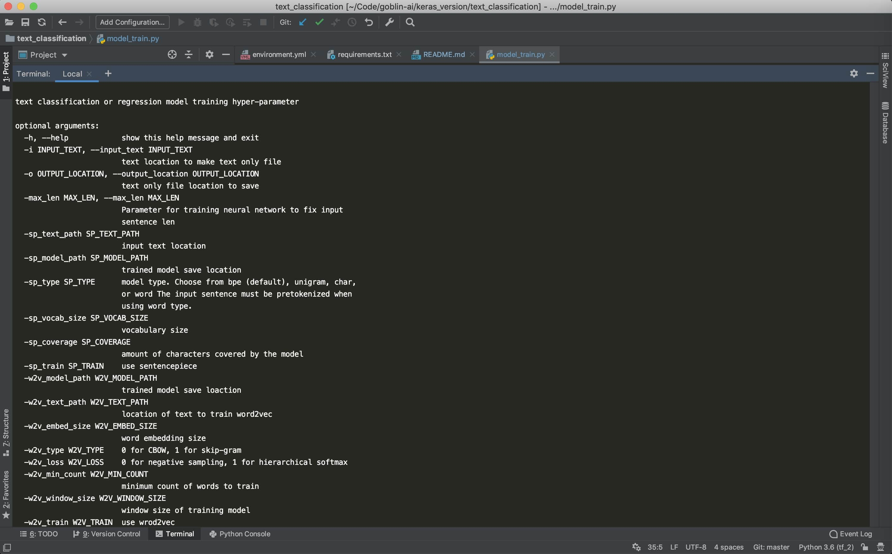
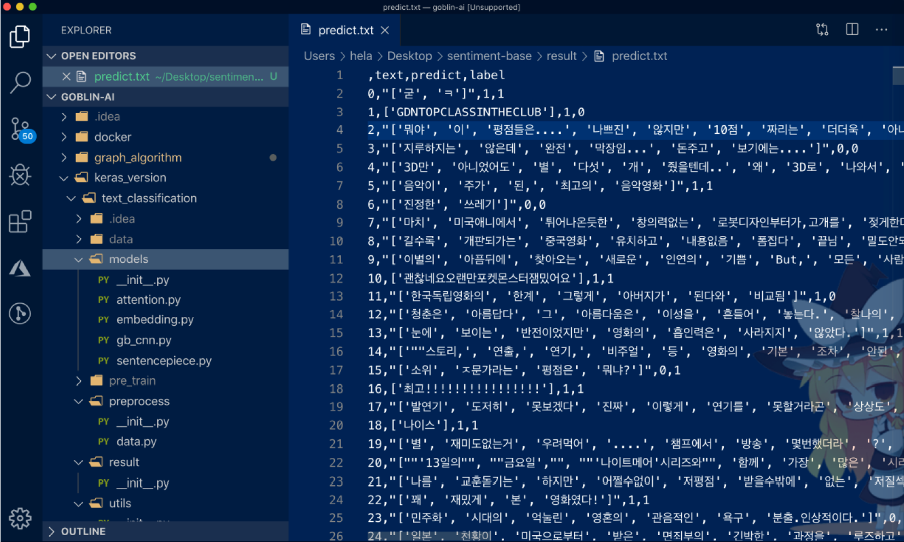

## Introduce (Korean Version)
- 긴 한국어 문장, 문서를 분류(classification), 회귀(regression)하는 convolution neural network를 기반으로 하는 deep learning model입니다.

- sentencepiece의 byte-pair-encoding알고리즘을 사용하여 언어의 제약을 받는(e.g. 언어별 형태소) Tokenizer가 아니라 OOV를 최소화 시킬 수 있으며 다국어에 적용 가능 합니다.

- 또한 한국어의 교착어의 특징을 추출 하기 위해 형태소 분석기를 이용하여 문장의 형태소를 분류 한뒤 word to vector을 통하여 단어 간의 vector space를 만들어 조금더 효율적인 성능을 보여주고 있습니다.

- sentencepiece + word to vector를 이용한 모델은 다양한 문서에 적용할 수 있으며 특히나 긴 문장, 문서를 분류할 경우에 강력한 성능을 보여 줄 수 있습니다.

- 지속적으로 최신의 paper 혹은 연구한 결과물을 implementation할 예정입니다 

- 추후 keras tunner를 이용하여 조금더 데이터에 state of the arts할 수 있는 모델을 제공할 예정 입니다.

## Environment
1. sentencepiece
2. gensim
3. sklearn
4. pandas
5. tqdm
6. tensorflow
7. keras

## Get Started
```bash
1. conda를 이용하여 가상환경을 설치 합니다.

$ conda create -n text_classification python==3.6.5
$ conda activate text_classification
$ python --version
$ Python 3.6.5
```
```bash
2. python package를 설치 합니다.

$ pip install -r requirements.txt
```
```bash
3. 학습을 하기 이전에 학습할 데이터를 준비합니다.
- train 데이터 경로 및 이름: data/train.txt (model_train.py 에서 경로 및 파일의 이름은 수정 가능 합니다.)
- validation 데이터 경로 및 이름: data/eval.txt (model_train.py 에서 경로 및 파일의 이름은 수정 가능 합니다.)

word2vec, convolution neural netwrok, sentencepiece 파라미터 정보는 확인은 --help명령어로 확인 할 수 있습니다
python model_train --help
```
- model train option

```bash
$(text_classifcation) python model_train --sp_train true \
                                         --w2v_train true

$(text_classifcation) python eval_train csv를 통해 결과 파일을 출력합니다 (추후 Goblin-AI에서 제공하는 Rest Api도 적용 예정)
```
- evaluation result

## Todo
 - [ ] Add reference

## Author
 - kyung tae kim (firefoxdev0619@gmail.com)

## References

```
@misc{text_classification 2019,
  author =       {kyung tae kim},
  title =        {text_classification},
  howpublished = {\url{https://github.com/helakim/goblin-ai/tree/master/keras_version/text_classification}},
  year =         {2019}
}
```

## Contact
For any question, feel free to contact :)
```
kyung tae kim     : firefoxdev0619@gmail.com
```