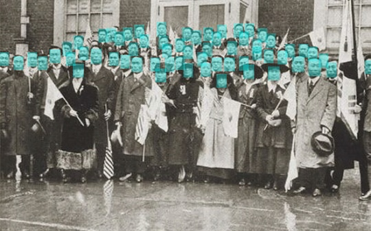

## Expansion Pyramid Network for high resolution face detection (Only-U)


---

| **`Status`** | **`Pyhon version`** | **`Language`** | **`Windows`** | **`Crated`** | **`Description`** | **`build`** |
|---------------------|------------------|-------------------|---------------|---------------|---------------|---------------|
| |||  |||

---

# **Only-U (Sunday 29, sep 2019)**

1. **Only-U** is implemented by PyTorch and CuDA and does not use external deep learning models.

2. The backbone model is a model that borrows the idea of the existing deep residual network and adds a transition block and is called **Block Wise Network**.

3. Although the detector model is similar to the U-NET, the 2-path way strategy can be used to communicate the amount of pixel information to the convolution unit more than the U-NET.

4. We use FP16 to reduce training times by 3 to 4 times compared to FP32.

## Installation (Dependencies)
    Todo 

## Only-U requires:
    1. pytorch 1.2.0
    2. torchvision >= 0.3.0
    3. opencv-contrib >= 3.3.49
    4. CUDA >= 10.0 and CuDnn >= 8.0

## Training DataSet
 - Deep Learning model learning data used Korean face image on ai-hub
 - [Ai-Hub Korean Face DataSet download link](http://www.aihub.or.kr/content/606)
 
## **Only-U** Training (Coming Soon)
```
python model_train.py -gpu=0,1 \  # multi-gpu 
                      -data_set=samples/train/annotation.json \
                      -val_set=samples/val/annotation.json \
                      -backbone=default # choose [atrous50, atrous101, atrous152, res50, res101, res152] \
                      -save_path=train_results \
                      -visdom_use=True
```

## **Only-U** Single Inference (Coming Soon)
 - Todo

## Inference Results
- multi-person facial detection (by google.com)


- basic facial detection (by google.com)


- 19th Century Person Face detection (by google.com)



- validation image detection (by ai-hub.co.kr)


## Todo
 - [ ] Deep Learning Model(Only-U) training code
 - [ ] Deep Learning Model(Only-U) inference code
 - [ ] Add reference

## Author
 - kyung tae kim (firefoxdev0619@gmail.com)

## References

```
@misc{Only-U 2019,
  author =       {kyung tae kim},
  title =        {Only-U},
  howpublished = {\url{https://github.com/helakim/goblin-ai/tree/master/pytorch_version/face_detection}},
  year =         {2019}
}
```

## Contact
For any question, feel free to contact :)
```
kyung tae kim     : firefoxdev0619@gmail.com
```