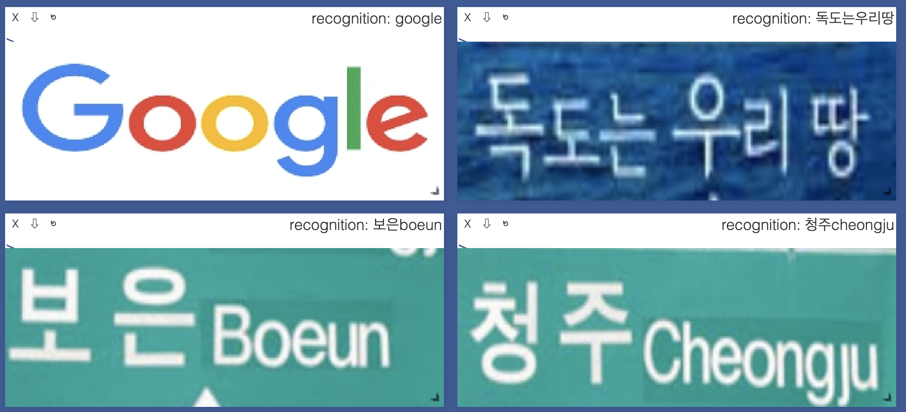
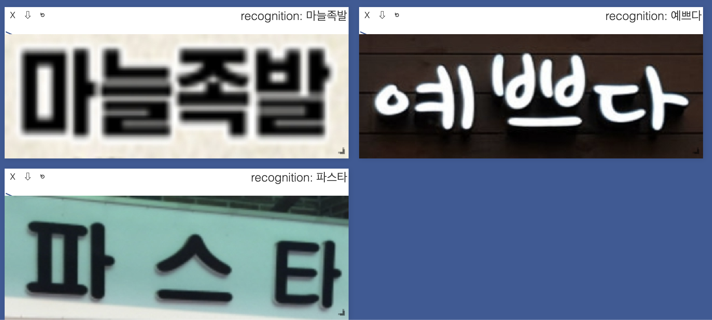

## High Efficient non-lexicon A model for Korean Text Recognition

---

| **`Status`** | **`Pyhon version`** | **`Language`** | **`Windows`** | **`Crated`** | **`Description`** | **`build`** |
|---------------------|------------------|-------------------|---------------|---------------|---------------|---------------|
| |||  |||

---

## Goblin-AI REST-API Preview :)

## HELA-EYE (Sunday 06, oct 2019)
- Optical character recognition을 해결 하기 위해Joint-CTC모델과 Weighted Attention Model 두가지를 제공 합니다 (지속적으로 state of the arts 논문을 구현 할 것 입니다)

- 한정 된 문자인식 테스크를 해결 하는것이 목적이 아니라 다양한 상황(e.g. 야외문자, 자동차 번호판, 명함, 신용카드, 여권)을 해결 하기 위해 절대적인 성능 보다 유연한 모델을 적용 했습니다 (사전학습 모델)

- post processing 실험을 통해 다양한 테스크에 적용 가능한 모델 입니다

- Goblin-Ai 제공하는 Rest API 서버를 적용하면 기존에 만들어진 Application에 빠르게 적용 할 수 있습니다

- Ai-HUB의 손글씨 데이터 인쇄체 데이터 GAN으로 생성한 데이터를 사용하여 학습 했습니다 GAN은 추후에 공개 예정 입니다

- FP16학습을 통해 FP32보다 3~4배 빠르게 딥 러닝 모델을 학습 할 수있습니다

- Visdom을 통해 시각화를 할 수 있습니다(e.g. 모델 그래프, loss 및 matirx)

- local machine 에서 training and evaluation 완료
## Environment
- pytorch 1.2.0
- torchvision >= 0.3.0
- opencv-contrib >= 3.3.49
- CUDA >= 10.0 and CuDnn >= 8.0
 
## HELA-EYE Training (Coming Soon)
 - Todo

## HELA-EYE Inference (Coming Soon)
 - Todo

## Inference Results
 

