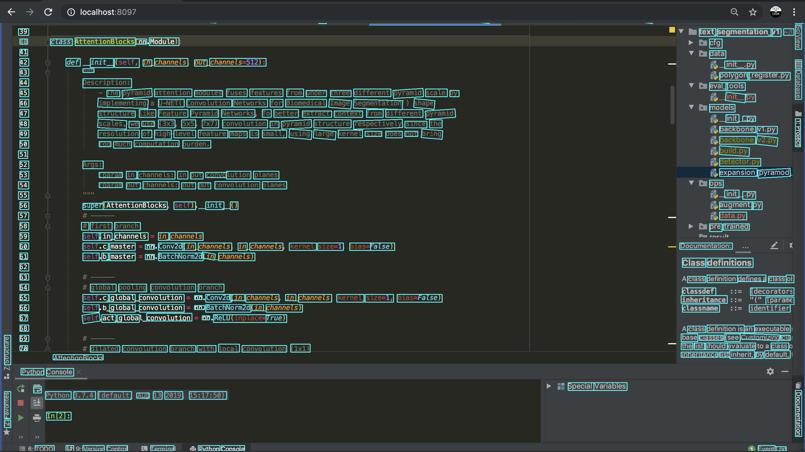
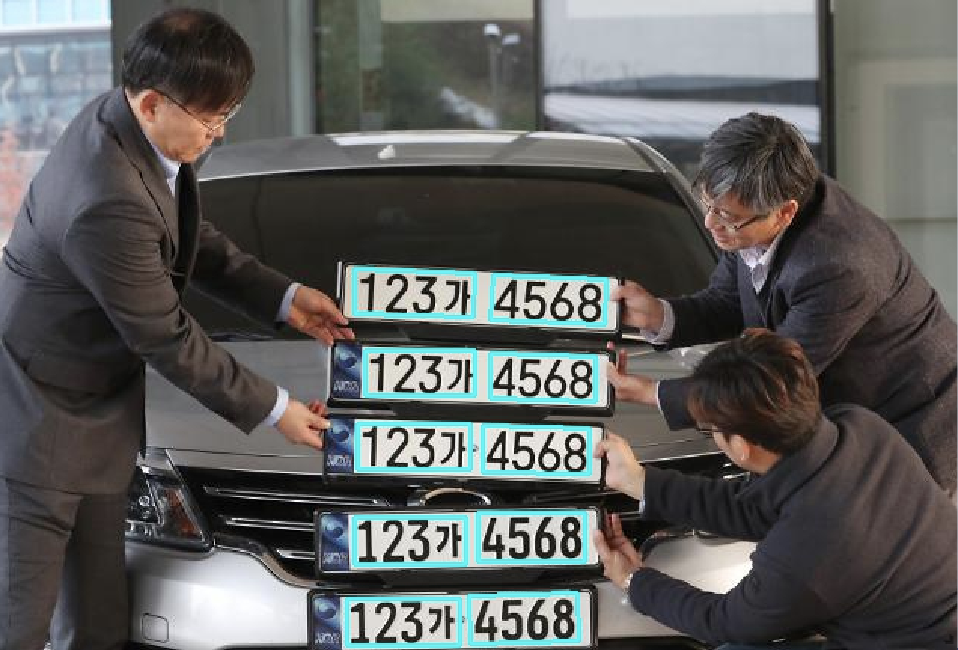
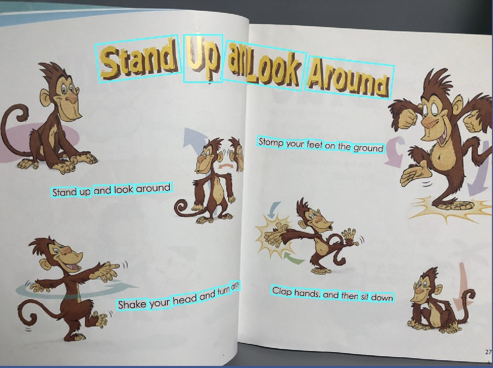
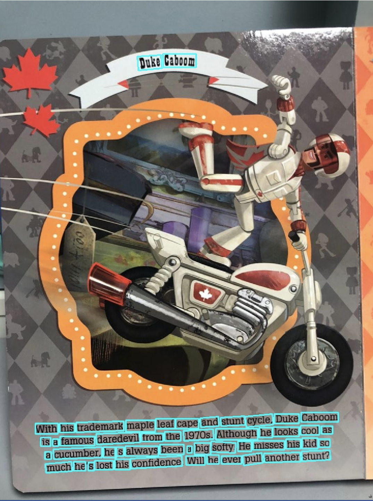
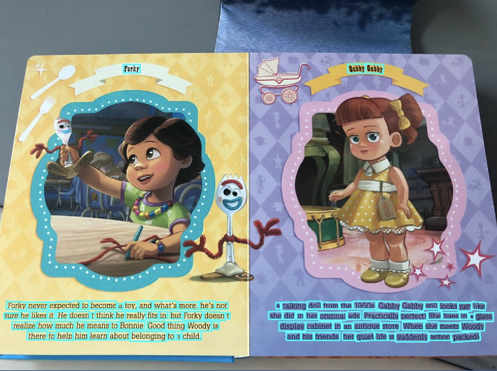

## Joint Attention Expansion Pyramid Network for Text Region Segmentation (JYP)



---

| **`Status`** | **`Pyhon version`** | **`Language`** | **`Windows`** | **`Crated`** | **`Description`** | **`build`** |
|---------------------|------------------|-------------------|---------------|---------------|---------------|---------------|
| |||  |||

---

# **Joint Pyramid Network-JYP (Fri 4, oct 2019)**

1. **Joint Pyramid Network-JYP** is implemented by PyTorch and CuDA and does not use external deep learning models.

2. Recognizing various objects such as business cards, resident registration cards, car license plates, credit cards, outdoor signboards, etc.

3. The backbone model is a model that borrows the idea of the existing deep residual network and adds a transition block and is called **Block Wise Network**.

4. Although the detector model is similar to the U-NET, the 2-path way strategy can be used to communicate the amount of pixel information to the convolution unit more than the U-NET.

5. We use FP16 to reduce training times by 3 to 4 times compared to FP32.


## Only-U requires:
    1. pytorch 1.2.0
    2. torchvision >= 0.3.0
    3. opencv-contrib >= 3.3.49
    4. CUDA >= 10.0 and CuDnn >= 8.0
    5. ETC
        - click
        - matplotlib
        - numpy
        - scipy
        - tqdm
        - visdom
        - scikit-image
        - pyclipper
        - fire
        
## Training DataSet
- Deep Learning model learning data used Korean Text on ai-hub -> (Korean DataSet)

- International Conference on Document Analysis and Recognition -> (English DataSet)

-  [Ai-Hub Korean Text DataSet download link](http://www.aihub.or.kr/content/495)

-  [ICDAR English Text DataSet download link](https://rrc.cvc.uab.es/?ch=15&com=downloads)

## JYP Training (Coming Soon)
```
python model_train.py --train default \
                      --gpu=0,1 \
                      --visdom_use=True \
                      --model_version=v1
```

## JYP Single or Batch Inference (Coming Soon)
```
python model_inference.py --model_path=pre_trained_model/best_acc.pth \
                          --visdom_use=True \
                          --image_path=samples
```

## Inference Result

- Detection License Plate (by google)
 
 
- Detection Scene text (My cell phone)
 
 
 
 
- Detection Pass port (by google)
 
 
 

## Todo
 - [ ] Deep Learning Model (JYP) training code
 - [ ] Deep Learning Model (JYP) inference code
 - [X] Add reference

## Author
 - kyung tae kim (firefoxdev0619@gmail.com)
 
## References
- [Detecting Text in Natural Image with Connectionist Text Proposal Network](https://arxiv.org/abs/1609.03605)

- [TextBoxes: A fast text detector with a single deep neural network](https://arxiv.org/pdf/1611.06779.pdf)
- [EAST: An Efficient and Accurate Scene Text Detector](https://arxiv.org/abs/1704.03155)
- [Multi-scale FCN with Cascaded Instance Aware Segmentation for Arbitrary Oriented Word Spotting In The Wild](http://openaccess.thecvf.com/content_cvpr_2017/papers/He_Multi-Scale_FCN_With_CVPR_2017_paper.pdf)
- [FOTS: Fast Oriented Text Spotting with a Unified Network](https://arxiv.org/abs/1801.01671)
- [Mask TextSpotter: An End-to-End Trainable Neural Network for Spotting Text with Arbitrary Shapes](https://arxiv.org/abs/1807.02242)
- [PixelLink: Detecting Scene Text via Instance Segmentation](https://arxiv.org/pdf/1801.01315.pdf)
- [IncepText: A New Inception-Text Module with Deformable PSROI Pooling for Multi-Oriented Scene Text Detection](https://arxiv.org/pdf/1805.01167.pdf)
- [Look More Than Once: An Accurate Detector for Text of Arbitrary Shapes Screen reader support enabled](https://arxiv.org/pdf/1904.06535.pdf)